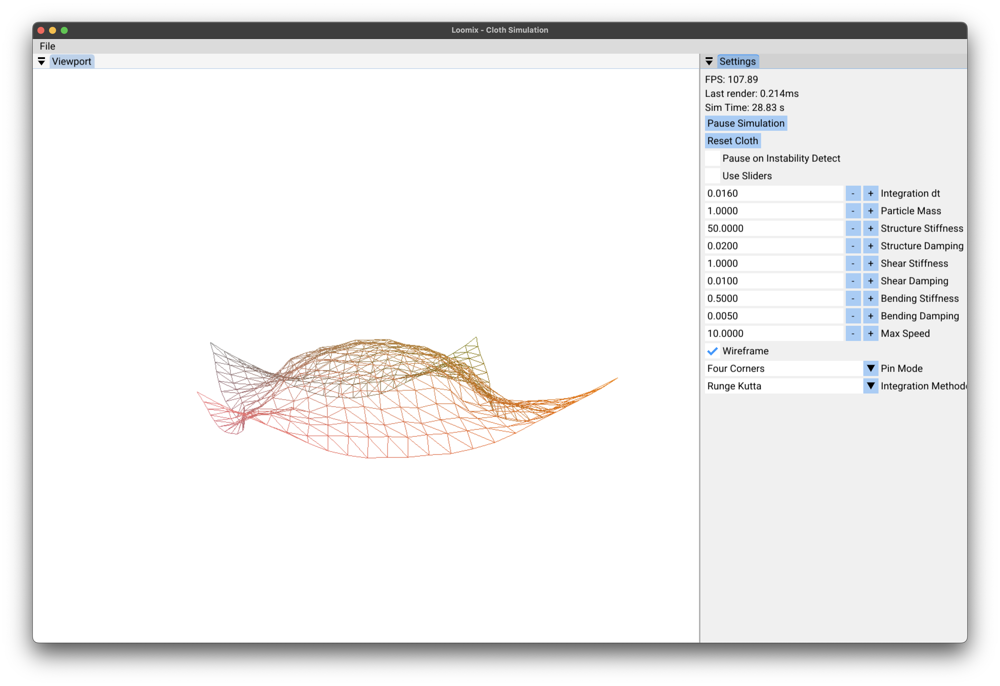

# Loomix – Cloth Simulation

Loomix is an interactive, real-time cloth simulation project written in C++20 using OpenGL and ImGui. It visualizes a cloth modeled as a mass-spring-damper system and allows users to adjust simulation parameters on the fly. The project supports multiple integration methods and includes built-in stability detection and a user-friendly UI.



## Features

- Real-time cloth simulation with structural, shear, and bending springs
- Multiple numerical integrators (Euler, Verlet, RK4)
- Instability detection and automatic pausing
- Toggle between wireframe and solid rendering

---

## Requirements

- A C++20 compatible compiler (Clang, GCC, or MSVC)
- CMake 3.15 or newer
- [vcpkg](https://github.com/microsoft/vcpkg) for dependency management

---

## How to Compile

### 1. Clone the repository
```bash
git clone --recurse-submodules https://github.com/your-username/loomix.git
cd loomix
```

### 2. Install dependencies using vcpkg
Make sure you have vcpkg installed and bootstrapped.

```bash
# Mac/Linux
./vcpkg/bootstrap-vcpkg.sh

# Windows (PowerShell)
.\vcpkg\bootstrap-vcpkg.bat
```

Then install the dependencies:
```bash
./vcpkg/vcpkg install imgui[glfw-binding,docking-experimental] glfw3 glm
```

### 3. Configure with CMake

#### macOS / Linux
```bash
cmake -B build -DCMAKE_TOOLCHAIN_FILE=./vcpkg/scripts/buildsystems/vcpkg.cmake -DCMAKE_BUILD_TYPE=Release
cmake --build build
```

#### Windows (PowerShell or Git Bash)
```bash
cmake -B build -DCMAKE_TOOLCHAIN_FILE=./vcpkg/scripts/buildsystems/vcpkg.cmake -DCMAKE_BUILD_TYPE=Release -A x64
cmake --build build --config Release
```

---

## How to Use

Run the built executable (`Loomix` or `Loomix.exe`), and you'll be greeted with a real-time simulation window:

- Adjust parameters such as stiffness, damping, particle mass, and time step using sliders.
- Switch between integration methods.
- Toggle wireframe mode.
- Reset or pause the simulation.
- Pin corner or edge particles via the dropdown menu.

Keyboard & Mouse Controls:
- `WASD` + Right Mouse Drag to move the camera
- Scroll to zoom

---

## Architecture

The project is modular and follows a layer-based architecture.

- `Cloth`: Manages particles and springs, applies forces and updates the simulation.
- `Particle` & `Spring`: Represent the physics data structures.
- `Integrator`: Abstract base class with concrete implementations: `ExplicitEuler`, `Verlet`, and `RK4`.
- `ClothLayer`: Handles ImGui UI and connects to the simulation loop.
- `Application`: Main engine that handles the lifecycle and rendering.
- `Camera`: Simple FPS-style camera for viewport navigation.

All rendering is handled via OpenGL. Shaders are loaded at runtime from the `shaders/` directory, and assets are copied into the build output automatically via CMake.

---

## Authors

- Leonard Chen (`chenl299@mcmaster.ca`)
- Steven Shi (`shij67@mcmaster.ca`)
